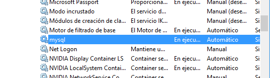
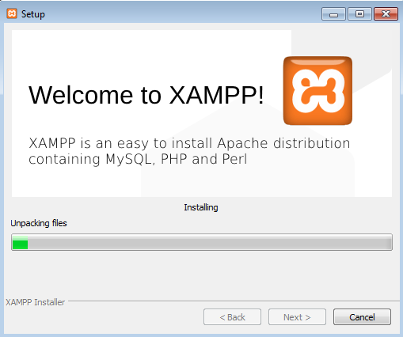

## Instalacion MYSQL community sobre Windows
* ###  Paso 1/
 vamos a la pagina de mysqk community y descargamos el mysql community pero antes descargar los prerequisitos    

 

 y tambien descargamos el python para que no nos de error la instalacion    
   
* a la hora de instalar el mysql workbench  ponemos instalacion en developer y Instalamos todos las partes
     

      

  y ya tenemos el servicio activo
  
      

* ### Paso 2/
 Ahora abrimos la ventadel terminal  en la que nosotros trabajaremos  

        

* ### Paso 3/  
  Ahora vamos a la ventana de servicios para ver que el servicio mysql esta habilitado       
        
  Abrimos la carpeta donde se encuentra la carepta APPDATA en nuestro PC    

            
* ### Paso 4/  
  Instalamos el workbench y el mysql en el cliente  
  workbench:  

      

  MYSQL:  

         

        al final no pudimos terminar la actividad por un error
