# Instalacion Mysql-server en ubuntu   

### Paso 1   
* Instalar mysql server y cliente desde otra maquina  
* Instalar Mysql-server  

  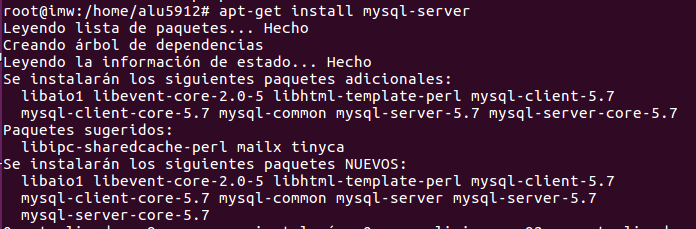   
  * nos pedira una contraseña    

  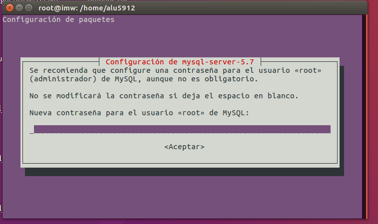         

* Instalar mysql-client    

  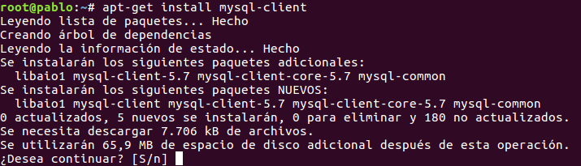  
### Paso 2  
* reiniciar demonio Mysql    

  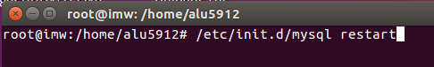

* y probamos que el proceso este correindo   

  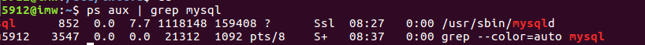  

 ### Paso 3   
* Probamos la coneccion al servidor   

 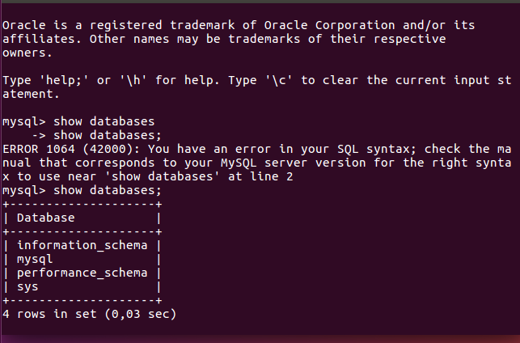  

 ### Paso 4  
* Instalamos el workbench    

  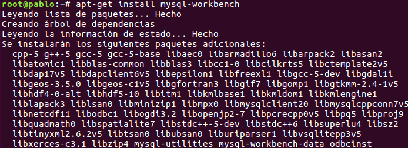   

 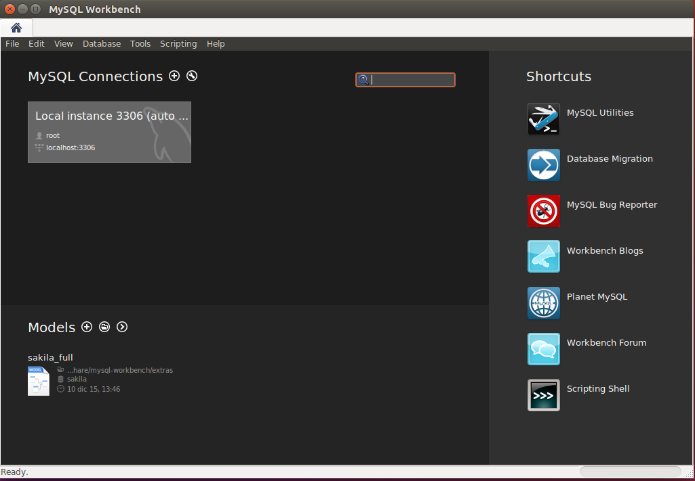    

 ### Paso 5   
* Instalamos phpmyadmin   

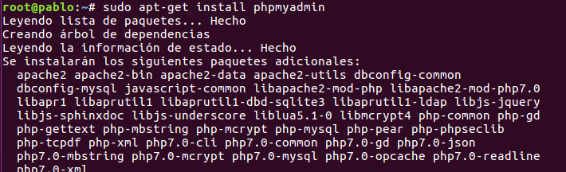

* ponemos el apache    

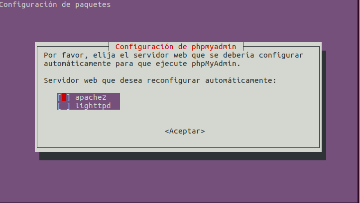   

* y ya esta listo   

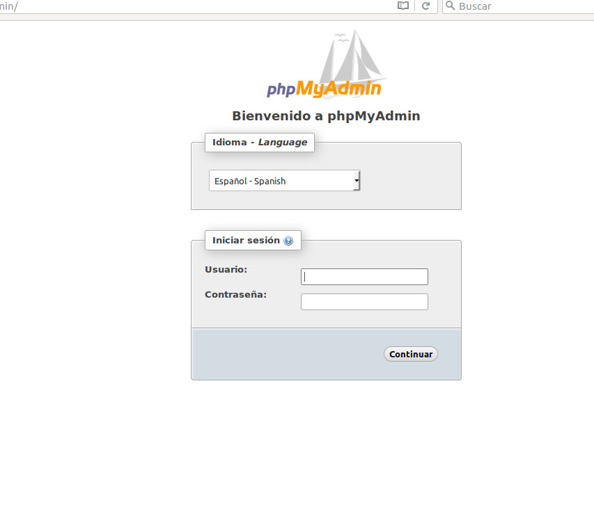  

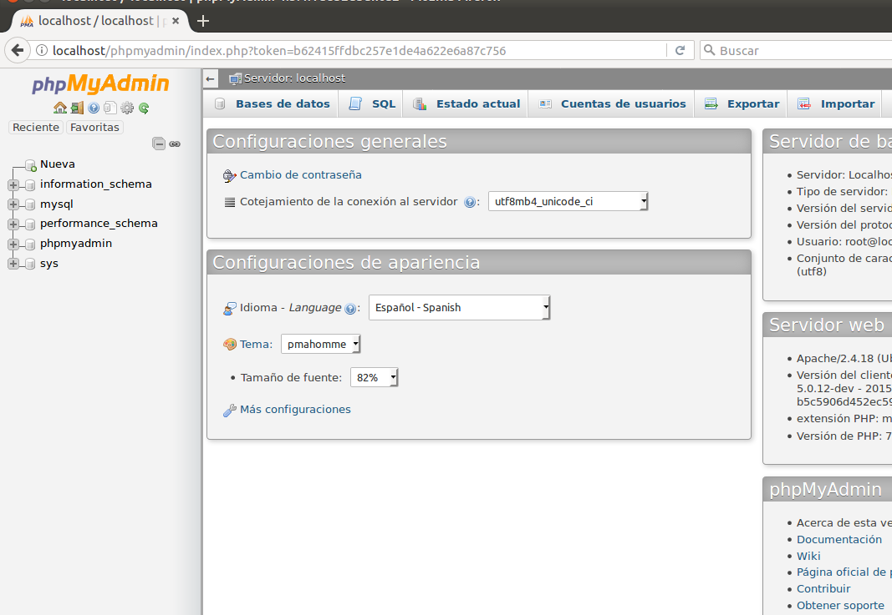

### Preguntas:
  * ¿Quién es el usuario propietario de la instalación ? Mysql  

   * Aplicar el lenguaje de los mensajes de error  a español, modificando la configuración (indicar el directorio donde se aloja el fichero en español)  

    * Buscamos el fichero de configuracion  

   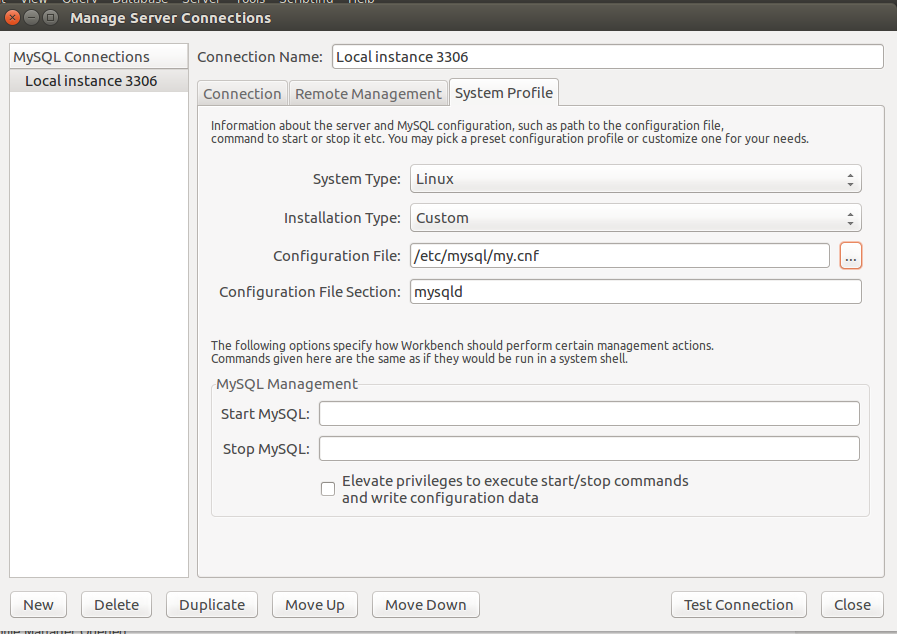  

   * marcamos "languaje" pinemos la ruta en spanish  y "lc-message"  ponemos es-ES  

   
  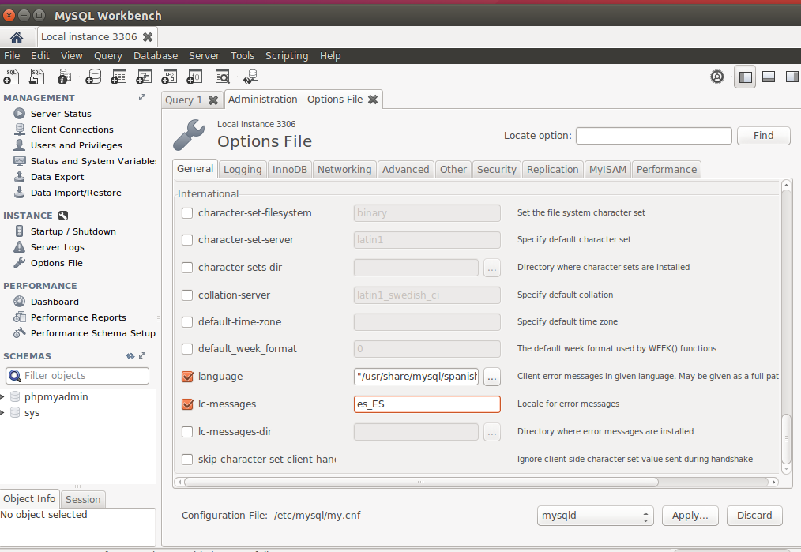
