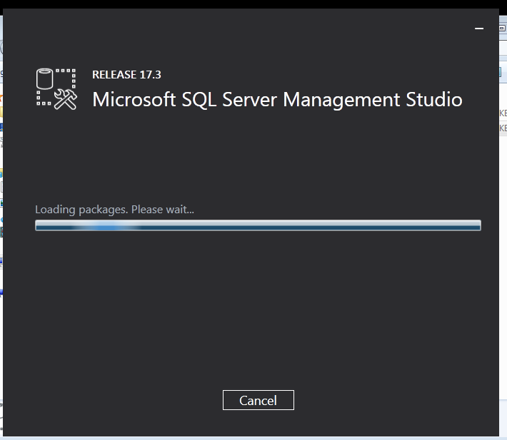

# *Instalacion de SQL Server 2014 Express*

### Paso 1 (Servidor)
    Instalamos MYSQL Management Studio en un servidor
    en Windows 10   

>Antes descargamos todos los archivos necesarios para que vaya el SQLserver

   

+ Y empezamos la Instalacion

  

  

  

     

### Paso 2 (Servidor)

    Ya finalizada la instalacion nos conectamos de forma local a nuestro servidor    

  

+  Le damos a conectar y nos conectamos de forma local

  

> pd: despues cambie el nombre que pone ahi de "DESKTOP.." por "PABLO-PC" para que sea mas facil de usar  

### Paso 3 (Servidor)
> Antes de nada bajamos el Firewall tanto en el cliente como en el servidor   

    A continuacion hacemos una configuracion del SQL server ,para ello nos iremos a inicio y
     escribimos "SQL server configuration manager"   
+ Activamos el Server Browser para que podamos especificarle a que maquina tenemos que conectarnos a traves de su ip

   

+ Activamos TCP/IP   

   

+ Y tambien lo activamos en el cliente  

   

### Paso 4  (Cliente)
>Usamos una maquina Windows 7  

+ Instalamos el Framework para que pueda funcionar en el cliente   

+ Instalamos el MYsql server 2014 en el cliente  

  

>(En el servidor) cuando este instalado , en el servidor vamos a PABLO-PC  con la sesion activada  y abrimos la pestaña de  "Seguridad/inicio de sesio/ sa" y cambiamos la contraseña de "sa"   

### Paso 5  (cliente)

+ Abrimos el cliente ,ponemos la ip del servidor "172.18.17.30" luego en "Authentication" ponemos "SQL server Authentication" , en Login ponemos "sa" y en Password la contraseña que pusimos previamente  

> Y finalmente nos conectamos

  
