# * Fichero de Opciones y variables de servidor *

## 1 -.Fichero de opciones:
### Preguntas :

* #### 1-Encuentra el fichero my.ini o my.cnf de tu instalación de MySQL

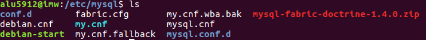  

* #### 3.¿Cómo se escribe un comentario en este fichero?¿Y un grupo de opciones?¿Todas las opciones tienen un valor?

   * Los comentarios se escriben con almohadilla "#" o con "!" .

   * Los grupos de opciones se hacen con "--" ,cualquier linea de opciones se aplica a cualquier grupo nombrado
 hasta que se de el final del archivo de opcion u otro linea de grupo

   * No, el valor se puede incluir opcionalmente

* #### 4. Ejecuta "mysqld --verbose --help" desde una consola para ver una lista de las variables del servidor. Para ver mejor el texto mejor redirecciona la salida a fichero.

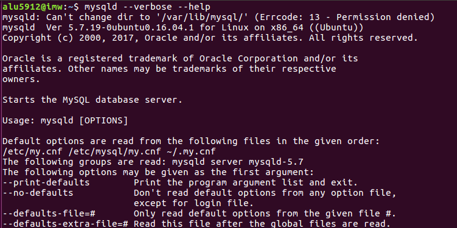  

* #### 5.Explica qué significan y que se consigue con cada una de las variables del siguiente fichero de configuración

  - [client] : en la variable cliente es un grupo general porque se usa para todos los programas del cliente"  

  - [mysqld]:esta variable solo sera leida por mysqld  

  - [mysqldump]:habilita opciones especificas de mysqldump para anular las pciones del cliente

## 2-. Variables de servidor

* #### 1. Define qué son las variables del servidor.
almacenan información relativa al entorno de ejecución de una aplicación   

* #### 2.Usa el comando "SHOW VARIABLES" para conocer el valor de todas las variables y enviar el resultado a un fichero.

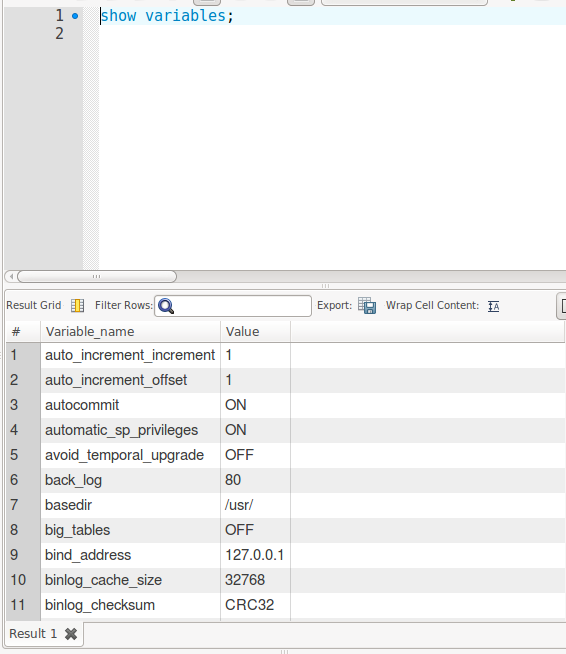  

* #### 3.Repite lo anterior para mostrar solo las variables relacionadas con el motor "InnoDB".

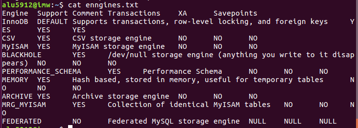    

* #### 4.Para gestionar variables tenemos, como hemos visto, el comando SHOW "comando":

    * cómo mostrar todos los motores de almacenamiento
    * cómo mostrar el estado *  actual del servidor
    * cómo averiguar todos los clientes que están conectados al servidor
    * cómo conocer todas las tablas que están abiertas  

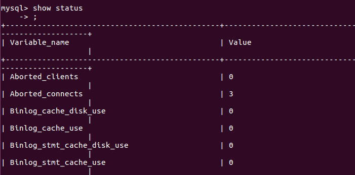   

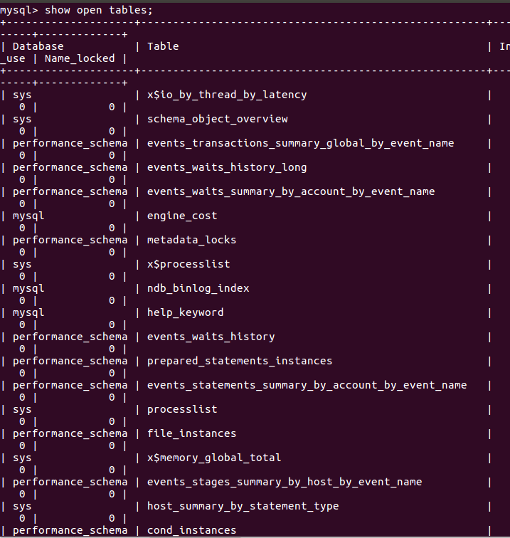

## 3-. Variables de estado  

* #### 1. Define qué son las variables de estado
 es una señal del sistema, es decir, una magnitud medible del mismo  

* #### 2. Usa el comando "SHOW STATUS" para conocer el valor de todas las variables.

   

* #### 3. Haz que uno o más de tus compañeros se conecte a tu servidor

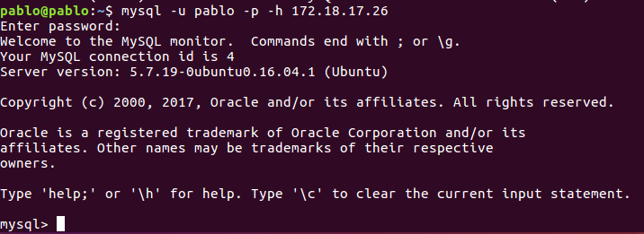  

* #### 4. Comprueba quién está conectado usando el comando correspondiente (Pista: es un comando visto SHOW XYZ).  

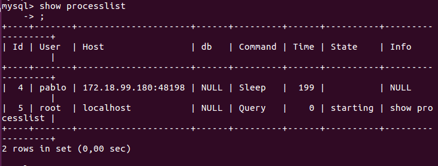   

* #### 5.Intenta desconectarlo con el comando "kill"   

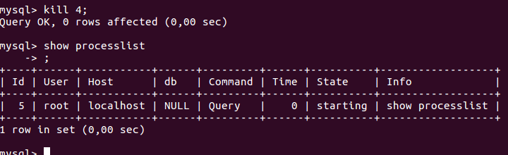  

* #### 6.¿Cuántas consultas se están ejecutado hasta el momento en tu servidor MYSQL? ¿Y si se trata de consultas lentas?

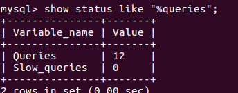   

* #### 7.Un estado informa  el sobre el máximo de conexiones concurrentes que se ha dado en la sesión de trabajo. ¿Cuál es?  

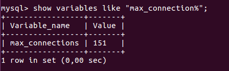   

## 3-. Variables dinamiacas    

* #### 1.Detalla los posibles atributos que tendría una variable de servidor como "port".
	- Name:Port
	- variable scope:Global
	- Dynamic Variable :No
	- type:integer
	- Default:3306
	- Min Value:0
	- Max Value:65535

* #### 2.¿Cómo podemos saber si una variable es dinámica o no?

 Porque son aquellas variables que  se pueden modificar mientras se ejecutan

* #### 3.-¿Qué hace la variable "uptime"?
 mide el tiempo que lleva activo el servidor desde su ultimo reinicio

   * Indica su valor en tu servidor
uptime :
2583  

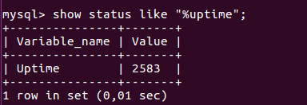  

  * ¿Es posible modificar su valor con comando SET?  

  no se puede modificar

* #### 4.Localiza la variable que establece el límite de conexiones concurrentes. ¿Cuál es?

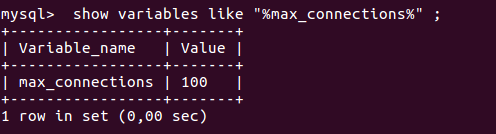  
