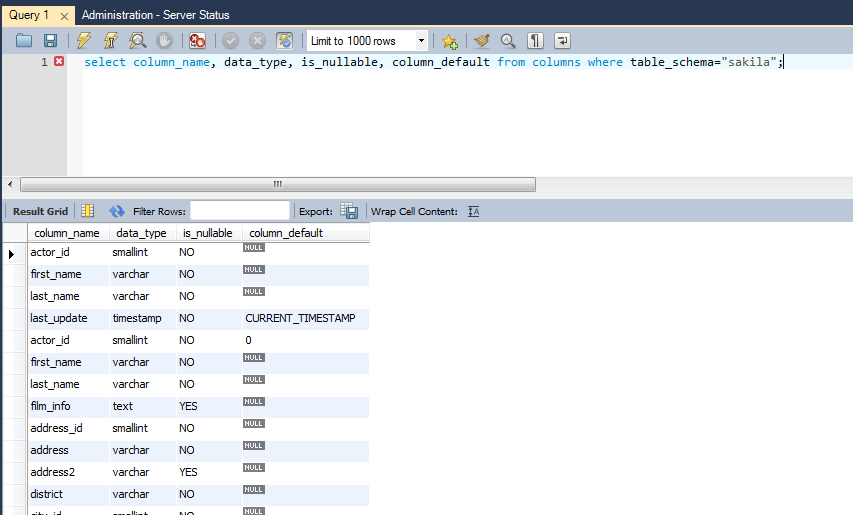
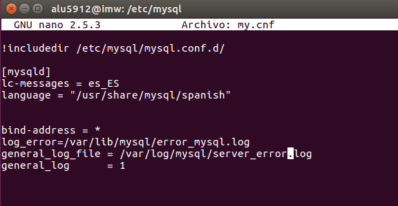

# Diccionario de Datos  

>El diccionario de datos es un componente esencial en cualquier SGBD ya que contiene información (metadatos) sobre los objetos de las bases de datos alojadas en nuestro servidor.   

**1 .-Interrogando la bases de datos Information_schema, extrae información (atributos table_name, table_type) sobre las tablas que conforman la base de datos "sakila".**    

   

  

**2 .-¿Cuál es el comando SHOW equivalente al anterior?**   

   

**3 .-Repite lo mismo extrayendo la información sobre el esquema de una tabla en particular de la base de datos "sakila"**  

    

 **4 .-¿Cuál es el comando SHOW equivalente al anterior?**  

     

 **5 .-Atendiendo a la base de datos "Information_schema", ¿cuáles son las tablas principales según tu criterio?**    

 >schema_privileges, table_privileges y user_privileges
