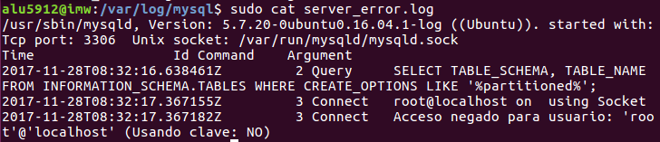
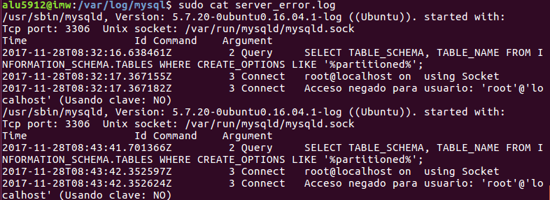
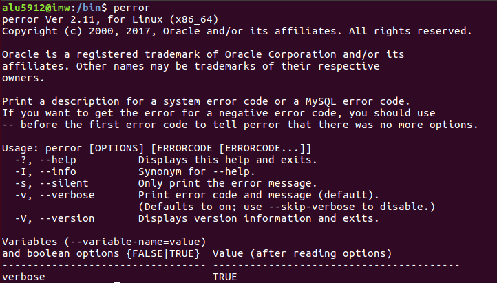
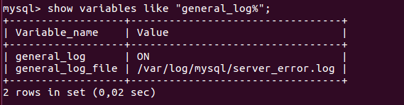
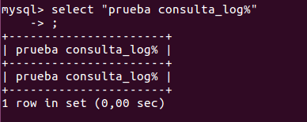
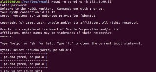
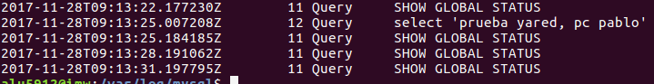
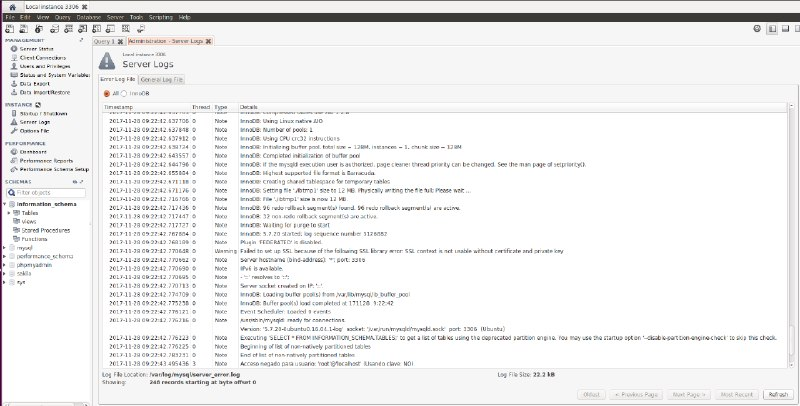

# Ficheros Log

* **1.-Explica qué es y para qué sirve el "ERROR LOG"**   

El registro de errores del servidor, cuyo nombre y ubicación se especifica en la directiva ErrorLog, es el más importante de todos los registros. Apache enviará cualquier información de diagnóstico y registrará cualquier error que encuentre al procesar peticiones al archivo de registro seleccionado.  

* **2.-Indica al servidor en "my.cnf" que registre los errores en un fichero llamado "server_error". Reinicia el servidor y comprueba los mensajes visualizando dicho fichero**    

   

  

* **3.-Detén el servidor abruptamente (haz lo que sea necesario) y comprueba cómo se ha modificado dicho fichero.**   

   

  

* **4.-Prueba la función "perror" incluida en el directorio bin. ¿Cuál es su objeto?**  

   

# Ficheros LOG: General Query LOG  

* **1.- Explica qué es y para qué sirve el "GENERAL QUERY LOG"**    

es un carchivo que guarada todo lo que se hace en la base de datos  

* **2.-Configura MySQL para registrar consultas generales en el fichero denominado "miserver.log". Comprueba su funcionamiento haciendo que un compañero se conecte a tu servidor y ejecute varias consultas**   

   

  

* **3.-Averigua viendo el fichero "miserver.log" la hora en que se conectó tu compañero y ejecutó las consultas del apartado anterior.**      

   

   

* **4.-Accede al servidor a través de Workbench. ¿Qué se registra en "general_log"?¿Hay alguna diferencia respecto al cliente mysql ?**  

